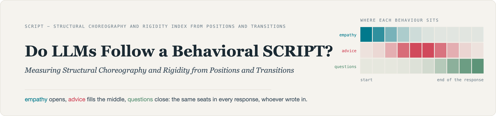
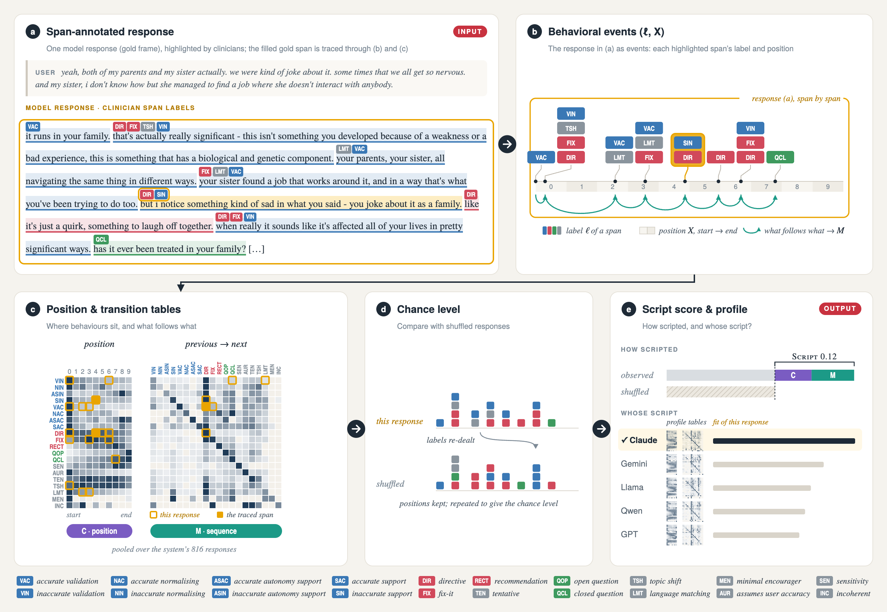

<div align="center">



<br><br>



<sub><i>Figure 1 of the paper: from one annotated response to the score and the profile.</i></sub>

<br>


</div>

<br>

## Setup

<sub><i>Python 3.10+, two dependencies for the metric, four for the paper. No API key needed: the blind LLM annotation layer of Testbed 1 is included as an event file (labels and positions, no text) at</i> <code>data/llm_span_events.csv</code><i>; only the span-by-span agreement table of Appendix A needs the per-reply cache, which a DeepSeek key regenerates.</i></sub>

```bash
git clone https://github.com/Mriyazat/script-metric.git && cd script-metric
python3 -m venv .venv && source .venv/bin/activate
pip install -r requirements.txt
bash reproduce.sh data          # fetch and verify every input, once (~500 MB)
```

<br>

## Reproduce the paper

<sub><i>One command per table and figure. Each prints the files it wrote to</i> `out/`.</sub>

<table>
<tr><td></td><td><code>bash reproduce.sh table2</code></td></tr>
<tr><td></td><td><code>bash reproduce.sh table3</code></td></tr>
<tr><td></td><td><code>bash reproduce.sh table4</code></td></tr>
<tr><td></td><td><code>bash reproduce.sh fig1</code></td></tr>
<tr><td></td><td><code>bash reproduce.sh fig2</code></td></tr>
<tr><td></td><td><code>bash reproduce.sh fig3</code></td></tr>
<tr><td></td><td><code>bash reproduce.sh numbers</code></td></tr>
<tr><td></td><td><code>bash reproduce.sh main</code></td></tr>
</table>

<sub><i>Appendix, one command per section.</i></sub>

<table>
<tr><td></td><td><code>bash reproduce.sh A</code></td>
    <td></td><td><code>bash reproduce.sh C1</code></td></tr>
<tr><td></td><td><code>bash reproduce.sh B1</code></td>
    <td></td><td><code>bash reproduce.sh C2</code></td></tr>
<tr><td></td><td><code>bash reproduce.sh B2</code></td>
    <td></td><td><code>bash reproduce.sh C3</code></td></tr>
<tr><td></td><td><code>bash reproduce.sh B3</code></td>
    <td></td><td><code>bash reproduce.sh C4</code></td></tr>
<tr><td></td><td><code>bash reproduce.sh B4</code></td>
    <td></td><td><code>bash reproduce.sh C5</code></td></tr>
<tr><td></td><td><code>bash reproduce.sh B5</code></td>
    <td></td><td><code>bash reproduce.sh C6</code></td></tr>
<tr><td></td><td><code>bash reproduce.sh D</code></td>
    <td></td><td><code>bash reproduce.sh appendix</code></td></tr>
</table>

`bash reproduce.sh list` shows every target; `bash run_all.sh` runs the whole pipeline in order.

<br>

## Use SCRIPT on your own annotations

<sub><i>A CSV with</i> `response_id`, `label`, `position` <i>(span start in [0, 1]).</i></sub>

```bash
python -m scriptmetric.metric  score    spans.csv --shuffles 200 --bins 10 --profile out.json
python -m scriptmetric.metric  score    spans.csv --ceiling
python -m scriptmetric.metric  distance a.json b.json
python -m scriptmetric.metric  identify probe_spans.csv profiles_dir/

python -m scriptmetric.betting test    spans.csv --alpha 0.05 --ci
python -m scriptmetric.betting compare a.csv b.csv
```

```python
from scriptmetric import metric
score, profile = metric.compute(metric.load_spans("spans.csv"))
```

<br>

<br>

## Data

<sub><i>Nothing is redistributed;</i> `reproduce.sh data` <i>fetches each source at its pinned revision.</i></sub>

[Cognitive Atrophy Benchmark](https://huggingface.co/datasets/abadawi/Cognitive_Atrophy_Benchmark) · [MINT / Lend an Ear](https://github.com/honglizhan/mint-empathy) · [AnnoMI](https://github.com/uccollab/AnnoMI) · [span annotations (WMT24, data-to-text, propaganda)](https://github.com/llm-span-annotators/span-annotation) · [RAGTruth](https://github.com/ParticleMedia/RAGTruth)
